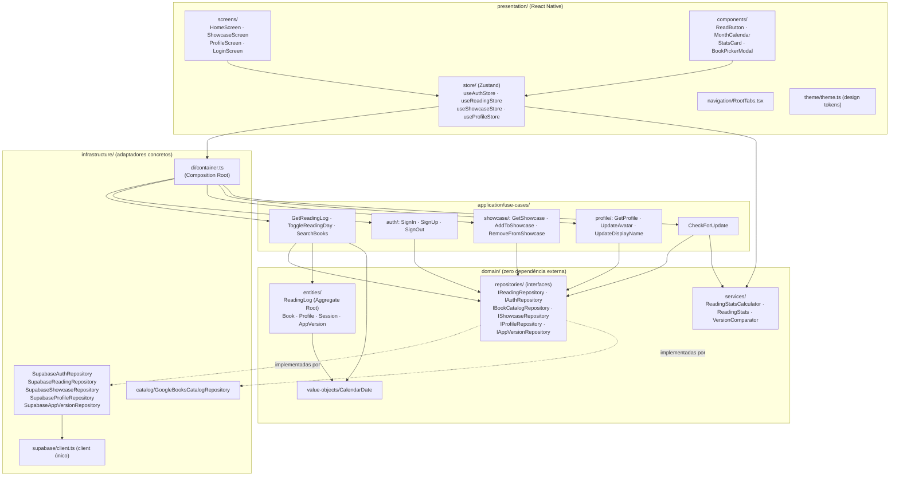
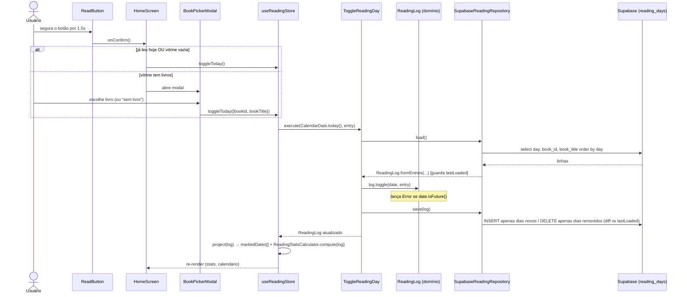
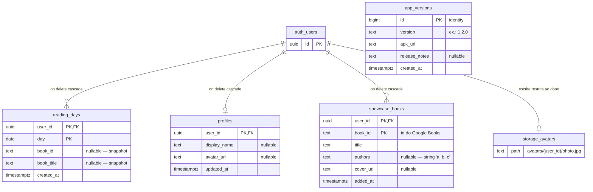
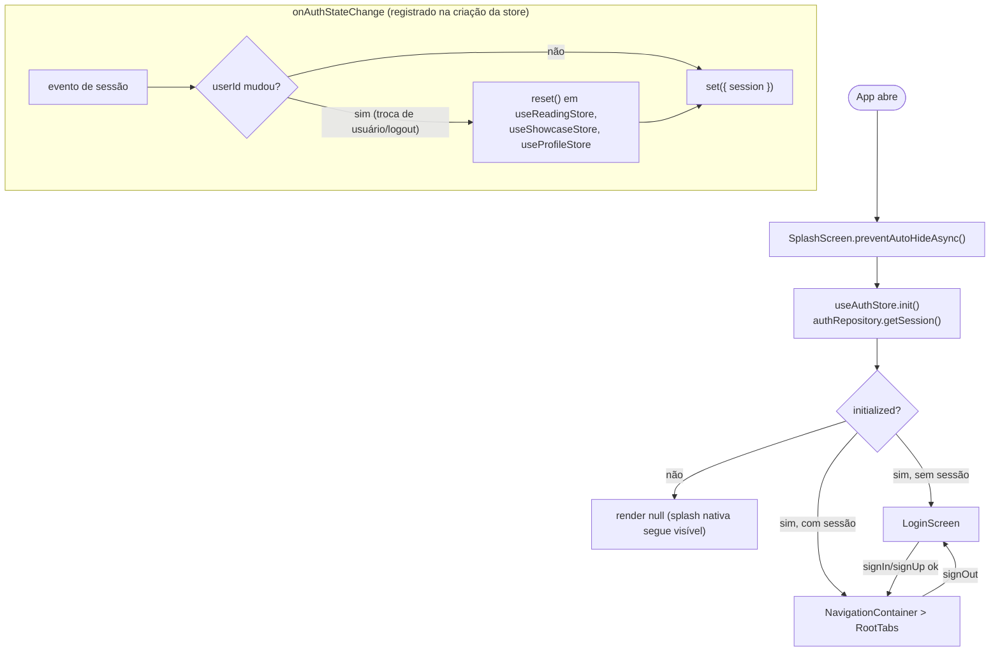
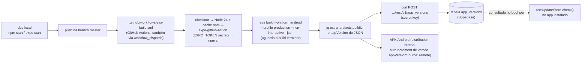
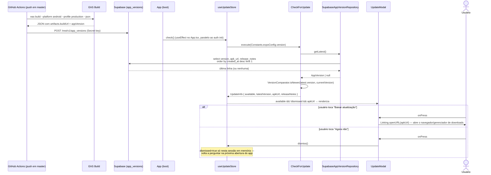

# Expo HAS CHANGED

Read the exact versioned docs at https://docs.expo.dev/versions/v57.0.0/ before writing any code.

---

# Track Read — Overview do Projeto (para Agentes)

> Este documento é direcionado a **agentes de IA** que vão trabalhar neste repositório.
> Leia-o inteiro antes de modificar qualquer código. Ele descreve o quê o app faz,
> como a arquitetura está organizada, quais invariantes NÃO podem ser quebradas e
> onde cada tipo de mudança deve ser feita.

> ## ⚠️ CLÁUSULA IMPORTANTE — Manutenção obrigatória deste documento
>
> **A cada nova funcionalidade, mudança de arquitetura ou alteração de
> comportamento incluída no projeto, a IA responsável pela implementação DEVE
> atualizar as seções pertinentes deste `AGENTS.md` no mesmo turno em que o
> código é entregue.** Não é opcional e não deve ser adiado para um pedido
> separado do usuário.
>
> Isso inclui, conforme o que a mudança tocar:
> - Adicionar a funcionalidade na tabela/lista da seção 1 ("Funcionalidades").
> - Atualizar os diagramas Mermaid (arquitetura, ER, fluxos de sequência) que
>   passem a estar desatualizados ou incompletos.
> - Documentar novas entidades, ports, casos de uso, repositórios,
>   stores/componentes na seção 4 e no mapa de arquivos (seção 9).
> - Registrar novas tabelas/colunas/migrações na seção 5.
> - Acrescentar novas invariantes e gotchas nas seções 10/finais, se a mudança
>   criar uma regra que não pode ser quebrada ou uma armadilha não óbvia.
> - Atualizar variáveis de ambiente, secrets de CI e comandos, se a mudança
>   afetar configuração/build/CI-CD (seção 8).
>
> Este documento existe para que qualquer agente futuro — sem o contexto desta
> conversa — entenda o projeto real, não uma versão desatualizada dele. Deixar
> o `AGENTS.md` divergente do código após uma implementação é considerado uma
> tarefa incompleta.

## 1. Identidade do projeto

| Item | Valor |
| --- | --- |
| Nome do app | **Track Read** (slug: `Book-Project`) |
| Propósito | Rastreador de hábito de leitura diária — estilo "contribution graph" do GitHub, mas para livros |
| Plataformas | Android (foco principal — builds EAS geram APK), iOS e Web (suportados via Expo, sem builds no CI) |
| Framework | Expo SDK **57** (`~57.0.1`) · React Native **0.86** · React **19.2.3** |
| Linguagem | TypeScript `~6.0.3`, `strict: true` (extende `expo/tsconfig.base`) |
| Estado | Zustand `^5` (stores em `src/presentation/store/`) |
| Navegação | React Navigation `^7` — bottom tabs apenas (sem stack navigator) |
| Backend | Supabase (Auth + Postgres + Storage) — chave *publishable*, RLS obrigatório |
| Catálogo de livros | Google Books API (REST, `fetch` direto) |
| Entry point | `index.ts` → `registerRootComponent(App)` → `App.tsx` |
| Package Android | `com.guilhermenono.bookproject` |
| Idioma do código | Comentários, mensagens de erro e strings de UI em **português (pt-BR)** |
| Commits | Conventional Commits em português (`feat:`, `fix:`, `chore:`...) |
| Testes | **Não existem testes no projeto** (nenhum runner configurado) |
| Lint/Format | **Não há ESLint/Prettier configurados** — siga o estilo dos arquivos existentes |

### Funcionalidades (visão de produto)

1. **Leitura (HomeScreen)** — botão "segure para confirmar" (1,5s de hold, constante
   `HOLD_DURATION_MS` em `ReadButton.tsx`); painel de estatísticas (streak atual,
   recorde, total, mês); calendário mensal interativo (toque em dia passado para
   corrigir). Regra de negócio central: **não se marca leitura em data futura**.
2. **Vitrine (ShowcaseScreen)** — busca na Google Books API com debounce de 400ms
   (`SEARCH_DEBOUNCE_MS`); adiciona/remove livros da vitrine pessoal. Ao marcar a
   leitura de hoje, se a vitrine não estiver vazia, um modal (`BookPickerModal`)
   pergunta qual livro foi lido e salva `bookId`/`bookTitle` junto do dia.
3. **Perfil (ProfileScreen)** — avatar via `expo-image-picker` (upload para o bucket
   `avatars` do Supabase Storage), nome de exibição editável, logout.
4. **Auth (LoginScreen)** — email/senha via Supabase Auth; o projeto Supabase exige
   **confirmação de email** antes do primeiro login (o `signUp` lança erro instrutivo
   quando `data.session` vem nulo). Sessão persistida em AsyncStorage.
5. **Aviso de atualização (`UpdateModal`)** — o app **não é distribuído pela Play
   Store** (APK sideload via EAS), então não há atualização automática do sistema.
   No boot, `useUpdateStore.check()` compara a versão instalada
   (`expo-constants` → `Constants.expoConfig.version`) com a última publicada na
   tabela `app_versions` do Supabase; se houver uma mais nova, mostra um pop-up
   **dispensável** com "Baixar atualização" (abre a URL do APK via `Linking`) e
   "Agora não". Ver seção 11 para o fluxo completo.

## 2. Arquitetura — Clean Architecture em 4 camadas

O código em `src/` segue Clean Architecture com inversão de dependência estrita.
**A regra de ouro do projeto**: nenhum componente/tela de UI importa `container`,
implementações concretas de infraestrutura ou entidades para lógica — a UI fala
apenas com as **stores Zustand**, que por sua vez chamam **casos de uso** via o
composition root (`src/infrastructure/di/container.ts`).



**Direção das dependências**: `presentation → application → domain ← infrastructure`.
O domínio não importa nada de fora dele. A infraestrutura implementa as interfaces
(ports) declaradas em `domain/repositories/`. O único lugar onde concreto encontra
abstrato é `container.ts`.

### Exceções conhecidas à regra (não "corrija" sem pedido explícito)

- As **stores** importam `container` e tipos do domínio (`ReadingLog`, `Book`,
  `CalendarDate`, `ReadingStatsCalculator`) — isso é intencional: a store é a
  fronteira entre React e os casos de uso.
- `HomeScreen` importa o **tipo** `Book` do domínio (uso apenas de tipagem).
- `useAuthStore` acessa `container.authRepository` diretamente (para `getSession`
  e `onSessionChange`) em vez de passar por um caso de uso.

## 3. Fluxo principal: marcar a leitura de hoje

Este é o caminho crítico do app. Qualquer mudança aqui exige atenção às invariantes.



Pontos de atenção neste fluxo:

- `SupabaseReadingRepository.save()` é **diff-based**: compara com o `Set`
  `lastLoaded` capturado no último `load()` e envia só inserts/deletes. `save()`
  sem um `load()` anterior na mesma instância se comporta como "inserir tudo".
  O caso de uso sempre faz `load()` antes de `save()` — mantenha esse contrato.
- `ReadingLog.toggle()` retorna `true/false` (marcou/desmarcou) e **lança** para
  data futura. O erro é capturado na store e vira `error: string` no estado.
- `toggleDate(iso)` (toque no calendário) não passa livro — só `toggleToday` liga
  a leitura a um livro da vitrine.

## 4. Domínio em detalhe

### `CalendarDate` (value object) — `src/domain/value-objects/CalendarDate.ts`
- Imutável; internamente uma string `YYYY-MM-DD` validada por regex.
- Representa um **dia civil local**, sem hora/timezone — comparações são string
  compare (`isFuture()` usa `this.value > today.toISO()`).
- `toDate()` ancora ao **meio-dia local** para evitar saltos de fuso.
- Fábricas: `fromISO`, `fromDate`, `today`. Operações: `addDays`, `previousDay`,
  `isToday`, `isSameMonth`, `equals`.
- **Nunca use `new Date().toISOString().slice(0,10)`** para obter "hoje" — isso
  usa UTC e quebra o conceito de dia civil local. Use `CalendarDate.today()`.

### `ReadingLog` (aggregate root) — `src/domain/entities/ReadingLog.ts`
- Encapsula um `Map<string /*ISO*/, ReadingEntry>` privado. `ReadingEntry` =
  `{ bookId: string | null, bookTitle: string | null }`.
- Invariantes: sem datas duplicadas (garantido pelo Map), datas sempre válidas
  (normalizadas via `CalendarDate.fromISO`), **sem marcação em data futura**
  (validado em `toggle`; `mark` direto não valida — use `toggle` em fluxos de UI).
- Serialização para persistência: `toISOList()` (só datas, ordenadas) e
  `toEntryList()` (datas + livro). Reconstrução: `fromEntries` / `fromISOList`.

### `ReadingStatsCalculator` (domain service)
- Funções estáticas puras: `currentStreak` (se hoje não foi marcado, o streak é
  medido a partir de **ontem** — o dia continua "vivo" até meia-noite),
  `longestStreak`, `countInMonth`, e `compute` que monta o read model
  `ReadingStats { total, currentStreak, longestStreak, thisMonth, readToday }`.

### `VersionComparator` (domain service)
- Função estática pura `isNewer(remote, local)`: compara duas strings semver
  simplificadas (`x.y.z`) numericamente por posição. Ausência de parte ou parte
  não numérica é tratada como `0`. Usada por `CheckForUpdate`.

### Entidades simples (interfaces, não classes)
- `Book { id, title, authors: string[], coverUrl: string | null }`
- `Profile { userId, displayName: string | null, avatarUrl: string | null }`
- `Session { userId, email: string | null }` — deliberadamente mínima.
- `AppVersion { version, apkUrl, releaseNotes: string | null }` — versão mais
  recente publicada, lida da tabela `app_versions`.

## 5. Banco de dados (Supabase / Postgres)

Schema em duas migrações idempotentes, nesta ordem:
[`migrations/010720261153.sql`](migrations/010720261153.sql) (schema principal) e
[`migrations/010720261530.sql`](migrations/010720261530.sql) (`app_versions`) —
rode ambas no SQL Editor do Supabase (não há CLI de migração configurada; nome
do arquivo é o timestamp `DDMMYYYYHHMM`). **Toda tabela tem RLS habilitado**;
`reading_days`/`showcase_books` usam `auth.uid() = user_id` para
select/insert/delete, `profiles` usa update em vez de delete, e
`app_versions` só tem policy de **select público** (`using (true)`) — não há
policy de insert/update/delete porque só a *secret key* do CI escreve
nela, e essa key ignora RLS.



> `app_versions` não tem relação com `auth_users` — é uma tabela global (uma
> linha por build publicado), não escopada por usuário.

Decisões de modelagem que agentes precisam respeitar:

- `reading_days.book_id`/`book_title` são um **snapshot desnormalizado**: se o
  livro sair da vitrine depois, o registro do dia mantém o título. Não crie FK
  para `showcase_books`.
- `showcase_books.authors` é uma **string única** juntada com `', '`
  (`SupabaseShowcaseRepository` faz join/split). Não mude para array sem migrar
  os dados e o adaptador juntos.
- Bucket `avatars` é **público para leitura**; escrita/update/delete exigem que a
  primeira pasta do path seja o `auth.uid()` do usuário. O path é fixo:
  `<user_id>/photo.jpg` (upsert). A URL pública recebe `?updated=<timestamp>`
  para cache-busting — preserve isso ao mexer em `updateAvatar`.
- Nenhuma linha de `profiles` é criada no signup — `load()` usa `maybeSingle()` e
  devolve campos nulos; a primeira escrita é um `upsert`.
- `app_versions` acumula uma linha por build (não é upsert) — "a mais recente"
  é sempre `order by created_at desc limit 1`. Não crie constraint de unicidade
  em `version`; builds re-executados manualmente no mesmo dia podem duplicar,
  o que é inofensivo (o `order by created_at` resolve o desempate).

## 6. Autenticação e ciclo de vida da sessão



- O client Supabase (`src/infrastructure/supabase/client.ts`) é **singleton**, usa
  AsyncStorage para persistir sessão, `autoRefreshToken: true`,
  `detectSessionInUrl: false`. Ele **lança na importação** se as env vars não
  estiverem definidas — qualquer código que importe a árvore de infraestrutura
  sem `.env` configurado quebra imediatamente (inclusive scripts/testes futuros).
- Usa a **Publishable key** (`sb_publishable_...`), nunca a Secret key. A Secret
  key ignora RLS e jamais deve aparecer neste repositório.
- Toda store de dados tem `reset()`; se você criar uma nova store com dados por
  usuário, **registre o reset dela no listener do `useAuthStore`** para não vazar
  dados entre contas.

## 7. Camada de apresentação — padrões

- **Stores Zustand** seguem o mesmo shape: estado (`loading`, `initialized`,
  `error: string | null`, dados) + ações assíncronas que capturam exceções e as
  transformam em `error` legível (mensagens em pt-BR). Siga esse formato.
- `useReadingStore` mantém uma **projeção** da UI (`markedDates: string[]` +
  `stats`), nunca o `ReadingLog` em si — a entidade é recalculada/projetada a
  cada operação via helper `project(log)`.
- **Telas** chamam `init()` da store em `useEffect` e renderizam
  `ActivityIndicator` enquanto `!initialized`. `HomeScreen` também inicializa a
  vitrine (precisa dela para o `BookPickerModal`).
- **Tema**: todos os estilos usam os design tokens de
  `src/presentation/theme/theme.ts` (dark theme fixo, `userInterfaceStyle: light`
  no `app.json` refere-se ao chrome nativo). **Não hardcode cores/espaçamentos** —
  adicione tokens se precisar. Cores base: background `#0F1115`, surface
  `#1A1D24`, primary `#6C8CFF`, accent `#FFB86C`.
- Animações usam a **Animated API do React Native core** (não Reanimated — não
  está instalado).
- Navegação: apenas `createBottomTabNavigator` com rotas `Leitura`, `Vitrine`,
  `Perfil` (tipadas em `RootTabParamList`). Ícones: Ionicons via
  `@expo/vector-icons`. Não há stack — modais são `Modal`/estado local.

## 8. Configuração, build e CI/CD

### Variáveis de ambiente (`.env`, exemplo em `.env.example`)

| Variável | Uso |
| --- | --- |
| `EXPO_PUBLIC_SUPABASE_URL` | URL do projeto Supabase (obrigatória) |
| `EXPO_PUBLIC_SUPABASE_PUBLISHABLE_KEY` | Publishable key (obrigatória) |
| `EXPO_PUBLIC_GOOGLE_BOOKS_API_KEY` | Opcional; sem ela a busca usa a cota anônima compartilhada do Google (esgota rápido) |

⚠️ Variáveis `EXPO_PUBLIC_*` são **embutidas no bundle em build-time**. Depois de
editar o `.env`, reinicie com `npx expo start -c`. Elas **não são secretas** no
app final — por isso só a publishable key é usada.

### Pipeline



- **Todo push em `master` dispara um build EAS de produção** (Android APK). O
  workflow **espera o build terminar** (`--json`, sem `--no-wait`) para poder ler
  a URL do artefato e publicá-la.
- Depois do build, o workflow extrai `artifacts.buildUrl` e `appVersion` do JSON
  retornado pelo `eas build` e grava uma linha nova em `app_versions` via REST
  do PostgREST, autenticado com a **Secret key** do Supabase (par server-side do
  sistema novo de API keys — mesma família da `sb_publishable_...` usada no
  app, mas com prefixo `sb_secret_...` e que ignora RLS; substitui a antiga
  `service_role` key legada). Se `buildUrl` vier vazio/nulo, o step falha
  explicitamente em vez de publicar uma versão sem APK.
- Perfis EAS (`eas.json`): `preview` e `production`, ambos APK interno. iOS não é
  buildado no CI de propósito (commit "Restringindo Build apenas para android").
- EAS project ID: `4a97149b-3980-4d94-b063-370ecc76714b` (em `app.json > extra.eas`).
- Secrets necessários no GitHub (Settings → Secrets and variables → Actions):
  - `EXPO_TOKEN` — já existia, autentica o `eas build`.
  - `SUPABASE_URL` — URL do projeto (mesmo valor de `EXPO_PUBLIC_SUPABASE_URL`,
    mas como secret separado porque é usado em `curl`, fora do bundle do app).
  - `SUPABASE_SECRET_KEY` — a **Secret key** (`sb_secret_...`) do projeto, em
    Project Settings → API Keys no painel do Supabase. **Nunca** deve ir para
    `.env`/`.env.example` nem para o bundle do app; existe só neste secret do CI.

### Comandos úteis

```bash
npm install        # instalar dependências
npm start          # Metro / Expo Go
npm run android    # dev build Android
npx expo start -c  # limpar cache (obrigatório após mudar .env)
npx tsc --noEmit   # única "verificação" disponível (não há testes/lint)
```

## 9. Mapa de arquivos (fora de node_modules)

```
Book-Project/
├── App.tsx                     # Root: splash, decide LoginScreen vs RootTabs pela sessão
├── index.ts                    # registerRootComponent(App)
├── app.json                    # Config Expo: ícones, splash, plugin image-picker, package Android
├── eas.json                    # Perfis de build EAS (preview/production, APK)
├── package.json                # Deps — sem lint, sem testes, scripts só de start
├── tsconfig.json               # strict, extende expo/tsconfig.base
├── .env / .env.example         # EXPO_PUBLIC_* (Supabase + Google Books)
├── migrations/
│   ├── 010720261153.sql        # Schema principal idempotente (tabelas + RLS + bucket avatars)
│   └── 010720261530.sql        # app_versions (idempotente) — rode depois do schema principal
├── .github/workflows/
│   └── eas-build.yml           # push master → EAS build Android production → publica versão no Supabase
├── assets/                     # Ícones, splash, adaptive icons Android
└── src/
    ├── domain/
    │   ├── entities/           # ReadingLog (classe/aggregate), Book, Profile, Session, AppVersion (interfaces)
    │   ├── value-objects/      # CalendarDate
    │   ├── services/           # ReadingStats (read model), ReadingStatsCalculator, VersionComparator
    │   └── repositories/       # I*Repository (6 ports)
    ├── application/use-cases/  # 1 classe por caso de uso, método execute()
    │   ├── GetReadingLog.ts · ToggleReadingDay.ts · SearchBooks.ts · CheckForUpdate.ts
    │   ├── auth/               # SignIn, SignUp, SignOut
    │   ├── profile/            # GetProfile, UpdateAvatar, UpdateDisplayName
    │   └── showcase/           # GetShowcase, AddToShowcase, RemoveFromShowcase
    ├── infrastructure/
    │   ├── di/container.ts     # Composition root — ÚNICO lugar que instancia concretos
    │   ├── supabase/client.ts  # Client singleton (AsyncStorage, publishable key)
    │   ├── auth/               # SupabaseAuthRepository
    │   ├── persistence/        # SupabaseReadingRepository (save diff-based), SupabaseShowcaseRepository
    │   ├── profile/            # SupabaseProfileRepository (tabela profiles + bucket avatars)
    │   ├── catalog/            # GoogleBooksCatalogRepository (fetch + normalização https)
    │   └── version/            # SupabaseAppVersionRepository (só leitura — CI escreve via Secret key)
    └── presentation/
        ├── screens/            # HomeScreen, ShowcaseScreen, ProfileScreen, LoginScreen
        ├── components/         # ReadButton (hold 1,5s), MonthCalendar, StatsCard, BookPickerModal, UpdateModal
        ├── store/              # useAuthStore, useReadingStore, useShowcaseStore, useProfileStore, useUpdateStore
        ├── navigation/         # RootTabs (bottom tabs: Leitura/Vitrine/Perfil)
        ├── theme/theme.ts      # Design tokens (dark)
        └── utils/calendar.ts   # Helpers de grade do calendário
```

## 10. Guia de modificação — onde mexer para cada tipo de tarefa

| Tarefa | Onde mexer (nesta ordem) |
| --- | --- |
| Nova regra de negócio sobre leituras | `domain/entities/ReadingLog.ts` (invariante) → caso de uso → store |
| Nova estatística | `domain/services/ReadingStats.ts` + `ReadingStatsCalculator.ts` → `StatsCard` |
| Nova fonte de dados/backend | Nova implementação em `infrastructure/` da interface existente → trocar em `container.ts` (só) |
| Novo dado persistido | `migrations/` (SQL idempotente + RLS) → port em `domain/repositories/` → adaptador → caso de uso → `container.ts` → store → tela |
| Nova tela/aba | `presentation/screens/` → registrar em `RootTabs.tsx` (+ `RootTabParamList` e `ICONS`) |
| Mudança visual | `theme.ts` para tokens; componente/tela para layout |
| Novo caso de uso | Classe com `execute()` em `application/use-cases/<área>/` → instanciar em `container.ts` → expor via store |

### Invariantes que NÃO podem ser quebradas

1. **Componentes de UI não importam `container` nem repositórios concretos** — tudo via store.
2. **Datas de leitura são dias civis locais** (`CalendarDate`), nunca `Date`/UTC cru.
3. **Não é possível marcar leitura em data futura** (validado no aggregate).
4. **Toda tabela nova precisa de RLS** com escopo `auth.uid() = user_id`.
5. **Somente a publishable key do Supabase** no cliente; nunca a secret key.
6. **`load()` antes de `save()`** no `IReadingRepository` (o save é diff-based).
7. **Store nova com dados por usuário** deve ter `reset()` registrado no listener de sessão do `useAuthStore`.
8. Migrações SQL devem ser **idempotentes** (`if not exists` / `drop policy if exists`).
9. **`app_versions` só é escrita pelo CI** (Secret key); o app/cliente nunca deve ter permissão de insert/update/delete nessa tabela.

### Gotchas conhecidos

- O client Supabase lança **no import** sem `.env` — não importe infraestrutura em código que precise rodar sem ambiente configurado.
- Capas do Google Books podem vir em `http:`; o adaptador normaliza para `https:` (Android bloqueia cleartext). Mantenha isso em novos campos de imagem.
- `expo-image-picker` tem permissão declarada no plugin em `app.json` (texto pt-BR). Novas permissões nativas exigem novo build (não funcionam via OTA/Expo Go automaticamente).
- `predictiveBackGestureEnabled: false` no Android é intencional.
- O streak "perdoa" o dia corrente: se hoje ainda não foi marcado, a contagem parte de ontem. Não trate isso como bug.
- `Constants.expoConfig.version` só reflete a versão *real* baked na build (útil porque `appVersionSource: "remote"` deixa o EAS resolver/incrementar a versão) — não confie no `version` estático de `app.json` como a versão instalada em produção.

## 11. Verificação de atualização (fluxo completo)

Como o app é distribuído por sideload (APK do EAS), não existe atualização
automática do sistema operacional — este mecanismo é a substituição caseira
para isso.



Pontos de atenção:

- **Falha de rede/checagem nunca deve travar o app** — `useUpdateStore.check()`
  captura qualquer exceção e apenas marca `checked: true` sem mostrar nada. Se
  for adicionar lógica nova aqui, preserve esse fail-safe.
- O `dismiss()` não persiste em disco (não usa AsyncStorage) — é
  deliberadamente efêmero por sessão. Se pedirem para "não perguntar de novo
  nesta versão", isso exigiria persistir a versão dispensada localmente; não
  implemente isso a menos que solicitado.
- `CheckForUpdate.execute()` recebe a versão atual como **parâmetro** (não lê
  `expo-constants` diretamente) para manter a camada `application/` livre de
  dependências de Expo/React Native — quem lê `Constants.expoConfig.version` é
  a store (`presentation/`), que é a fronteira certa para isso.
- Antes do primeiro build publicar uma linha em `app_versions`, `getLatest()`
  retorna `null` e nenhum pop-up aparece — comportamento seguro por padrão.
